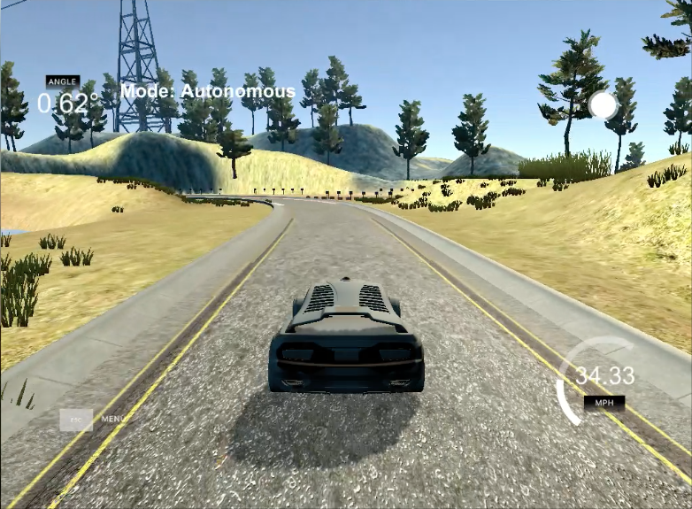

### P - Proportional

P accounts for present values of the error. For example, if the error is large and positive, the control output will also be large and positive. So, P allows us to control the position of the car on the road.

### D - Derivative

D accounts for possible future trends of the error, based on its current rate of change. Therefore, D allows us to control the oscilation of the car.

### I - Integral

I accounts for past values of the error. For example, if the current output is not sufficiently strong, the integral of the error will accumulate over time, and the controller will respond by applying a stronger action. Therefore, I allows us to determine the steady-state of the car.

## Hyper-parameters

The hyper-parameters were tunned manually. It means that firstly I tunned the Kp coefficient to allow the car to stay in the middle of the road (the center-line). After this, I tunned the Kd coeffient in order to reduce the oscilation of the car, and at the end, I tunned the Ki coefficient in order to decrease the steady-state of the car.

## Video

